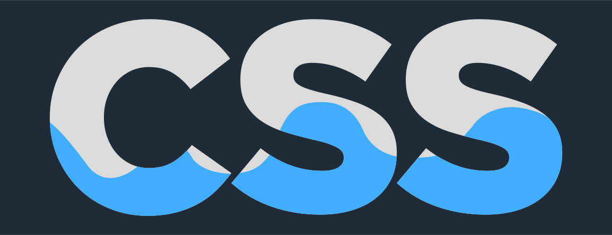

<p align="center">
  <!-- <a href="https://www.npmjs.com/package/water.css"></a> -->
  <a href="https://www.reddit.com/r/webdev/comments/b9m6mv/watercss_a_collection_of_neat_styles_for_simple/"></a>
  <a href="https://www.producthunt.com/posts/water-css"></a>
  <a href="https://github.com/kognise/water.css/blob/master/LICENSE.md"></a>
</p>

<br>

<h1 align="center">Water.css</h1>
<p align="center">🌊 A drop-in collection of CSS styles to make simple websites just a little nicer</p>

[](https://watercss.netlify.com/)

<br>

## Goals

- Responsive
- Themeable
- Good browser support (works on my old kindle's browser :P)
- Tiny size
- Beautiful
- No classes

## Why?

I commonly make quick demo pages or websites with simple content. For these, I don't want to spend time styling them but don't like the ugliness of the default styles.
Water.css is a CSS framework that doesn't require any classes. You just include it in your `<head>` and forget about it, while it silently makes everything nicer.

## Who?

You might want to use Water.css if you're making a simple static page or demo website that you don't want to spend time styling.

You probably don't want to use it for a production app or something that is more than a simple document. Rule of thumb: if your site has a navbar, don't use Water.css. It's just not meant for that kind of content.

## How?

Just stick this in your `<head>`:

### 🌙 Dark Theme:

`<link rel="stylesheet" href="https://cdn.jsdelivr.net/gh/kognise/water.css@latest/dist/dark.min.css">`

### ☀ Light Theme:

`<link rel="stylesheet" href="https://cdn.jsdelivr.net/gh/kognise/water.css@latest/dist/light.min.css">`

<br>

### Other options:

> ⚡ An interactive version selection is available [on the **demo page**!](https://watercss.netlify.com/#installation)

#### Enforce a theme and ignore `(prefers-color-scheme)`

For the main versions, `dark` or `light` is only treated as a _default theme_: if a user has a system-wide preference for either dark or light mode on their device, `water.css` will respect this. If you want to avoid this behavior and enforce dark or light theme, append `.standalone` to the theme prefix, e.g. `dark.standalone.min.css`.

#### Want to support Internet Explorer?

Sure, just extend the theme prefix with `-legacy`, e.g. `dark-legacy.min.css`.
Be aware that these versions **do not support** [runtime theming](#theming) as they use hard coded values rather than variables. Additionally, if you use a legacy version that is not standalone, we recommend [you add the respective preload tags to improve load times](https://watercss.netlify.com/?legacy#installation).

#### Unminified builds

All versions are also available as unminified stylesheets, which can be handy during development.
Simply remove the `.min` from the file name.

## Theming

Do you want to make some adjustments or build your own theme completely different from the official dark or light themes? Since Water.css is built with CSS variables this is super easy to do!  
You can find a full list of the variables used at [**src/variables-\*.css**](https://github.com/kognise/water.css/tree/master/src/variables-dark.css).

### Runtime theming

> ⚠ If you use a version with support for legacy browsers like Internet Explorer, skip to [Compiling your own theme](#compiling-your-own-theme)!

Water.css uses Custom Properties (_"CSS variables"_) to define its base styles such as colors. These can be changed and overwritten right in the browser.  
Because of this, you can simply add your own stylesheet to the page and set your own CSS variables there. As long as your stylesheet comes after Water.css in the HTML, your values will override the default ones and your theme is applied!

This short example will use Water.css, but color all links red:

```html
<link rel="stylesheet" href="https://cdn.jsdelivr.net/gh/kognise/water.css/dist/dark.min.css" />
<style>
  :root {
    --links: red;
  }
</style>
```

If you want to change a value for dark or light mode only, use a media query like so:

```html
<style>
  :root {
    --links: blue; /* Always applied */
  }
  @media (prefers-color-scheme: dark) {
    :root {
      --links: yellow; /* Only applied in dark mode (overrides previous declarations while applied) */
    }
  }
</style>
```

### Compiling your own theme

If you are targeting browsers without support for CSS Custom Properties such as Internet Explorer, runtime theming is not an option. To apply your own theming, you'll need to make your changes in the source files themselves, then re-compile the CSS files. This works like the following:

- Clone the repository to your machine
- Run `yarn` to install dependencies
- Make the theming changes you want in `src/variables-*.css`
- Run `yarn build` to compile the CSS files
- Use the compiled files in the `dist/` directory on your site

When making your changes, we recommend you don't change the values set by Water.css directly, instead simply add your own variable declarations:

```css
:root {
  /* Water.css variable declarations... */
}

/* ⬇ Add this block! */
:root {
  /* Your variable declarations, overriding previous ones */
}
```

You also might want to check out the [Contributing Guide](https://github.com/kognise/water.css/tree/master/.github/CONTRIBUTING.md) as it contains further information about the build setup.

## Contributing

Water.css becomes better for everyone when people like you help make it better!

Have any questions or concerns? Did I forget an element or selector? Does something look ugly? Feel free to submit an issue or pull request.

If you decide to contribute, after downloading a copy of the repository make sure to run `yarn` to install dependencies useful for development. Then, you can run the following to start a server of the demo with live reloading on change.

```
$ yarn dev
```

**Alternatively, just click this button to develop in Repl.it, a supercool in-browser IDE!** [](https://repl.it/github/kognise/water.css)

Before submitting your first pull request, make sure to check out our [Contributing Guide](https://github.com/kognise/water.css/tree/master/.github/CONTRIBUTING.md)!  
Thanks for taking the time to contribute :)

## Todos

- Add screenshots
- Release Jekyll theme ([#18](https://github.com/kognise/water.css/issues/18))
- Publish to npm ([#41](https://github.com/kognise/water.css/issues/41))
